# PRAKTIKUM 2

Nama = Bagas Prambudi
Kelas = MI 2C
PRODI = D3-MI

## basic_flutter

Gambar alignment
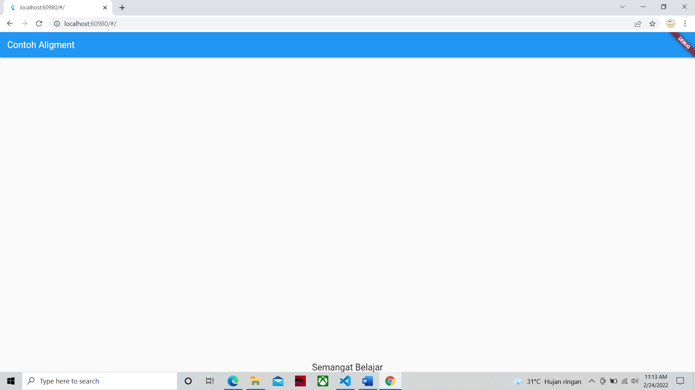
Nama = Bagas Prambudi Nim = 2031710108

Gambar child
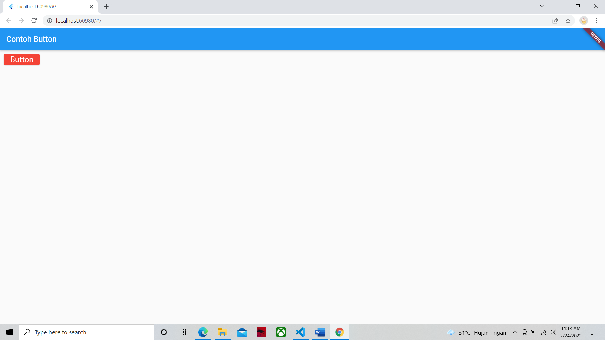
Nama = Bagas Prambudi Nim = 2031710108

Gambar color
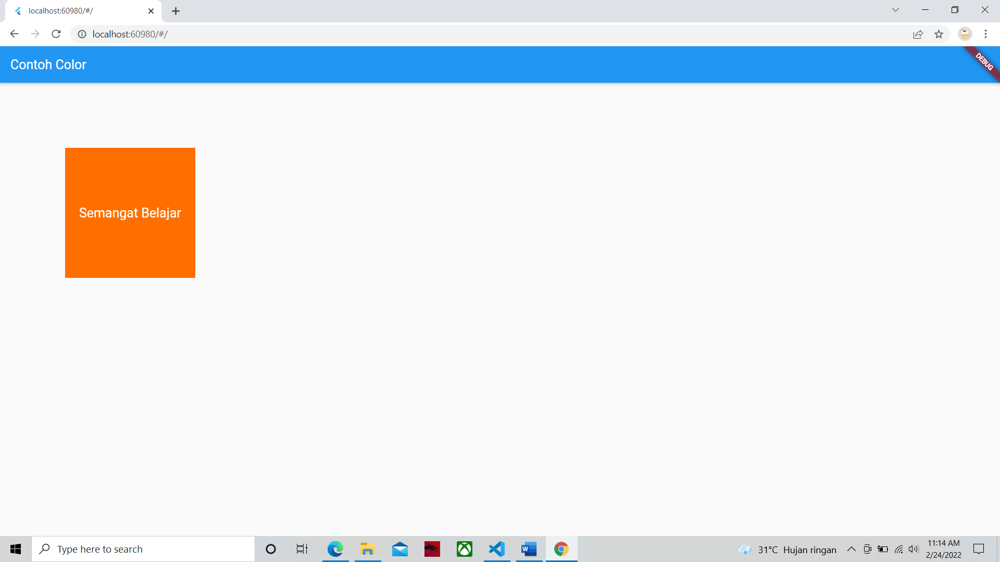
Nama = Bagas Prambudi Nim = 2031710108

Gambar column
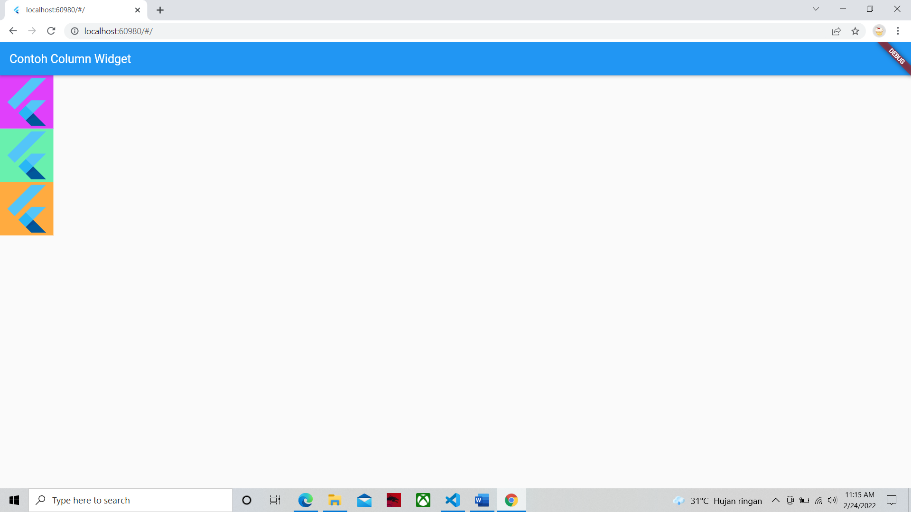
Nama = Bagas Prambudi Nim = 2031710108

Gambar cupertino
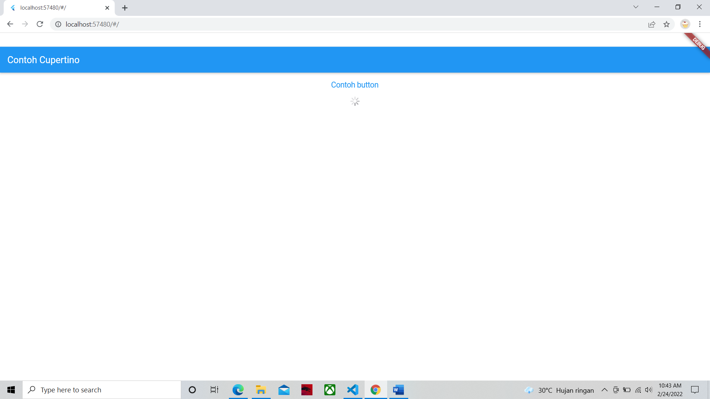
Nama = Bagas Prambudi Nim = 2031710108

Gambar datetime
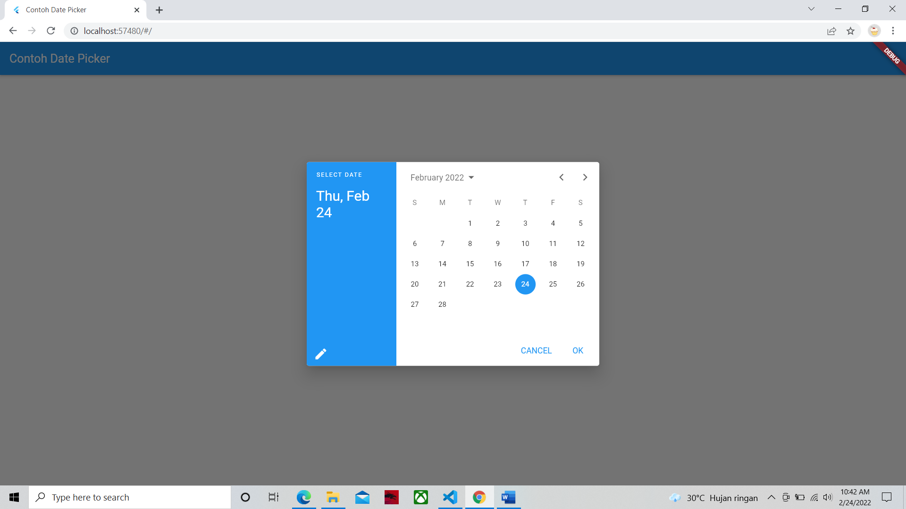
Nama = Bagas Prambudi Nim = 2031710108

Gambar dialog
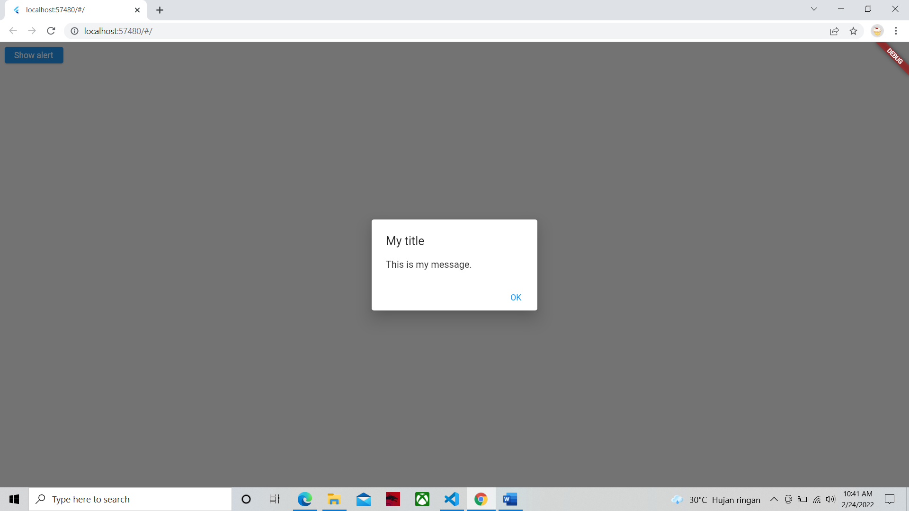
Nama = Bagas Prambudi Nim = 2031710108

Gambar grid
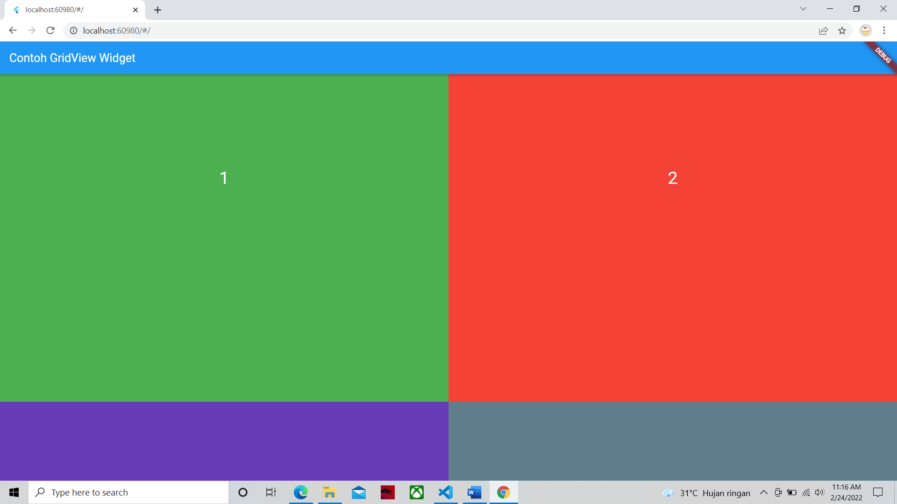
Nama = Bagas Prambudi Nim = 2031710108

Gambar image
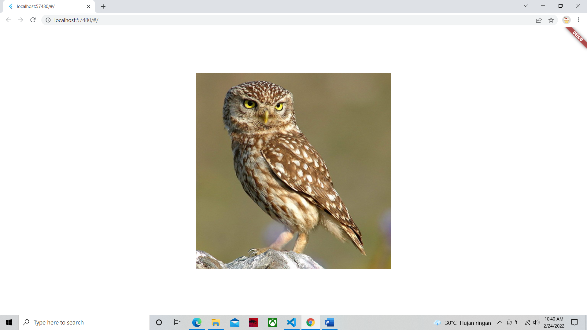
Nama = Bagas Prambudi Nim = 2031710108

Gambar margin
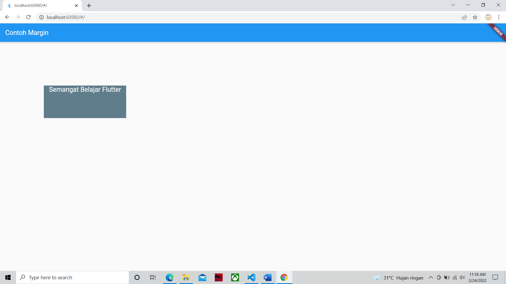
Nama = Bagas Prambudi Nim = 2031710108

Gambar padding
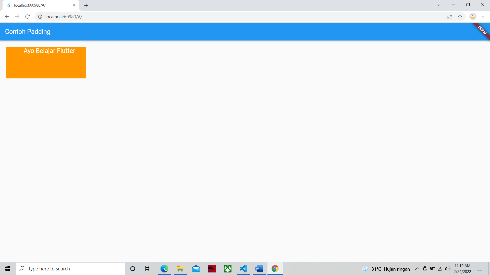
Nama = Bagas Prambudi Nim = 2031710108

Gambar row
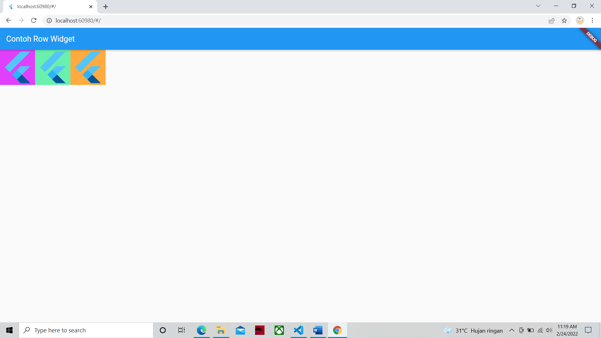
Nama = Bagas Prambudi Nim = 2031710108

Gambar scaffold
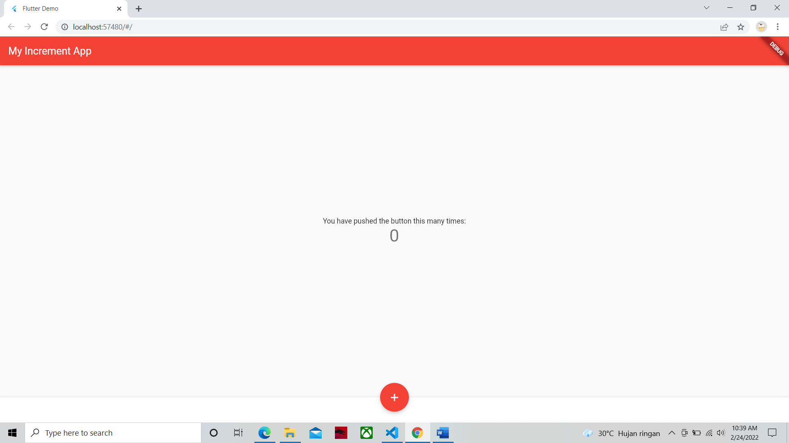
Nama = Bagas Prambudi Nim = 2031710108

Gambar stack
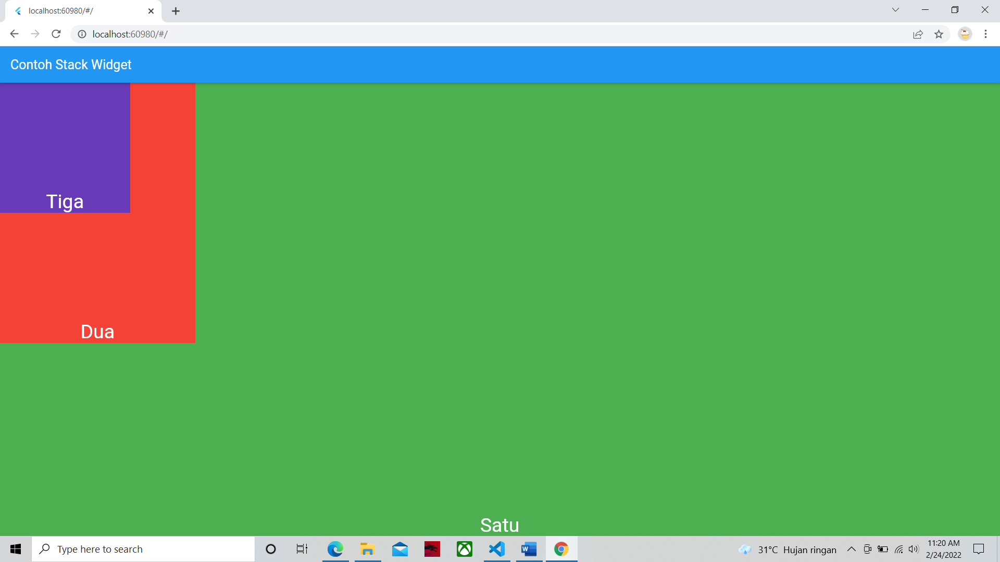
Nama = Bagas Prambudi Nim = 2031710108

Gambar text
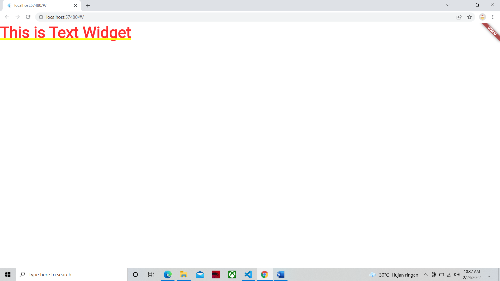
Nama = Bagas Prambudi Nim = 2031710108

Gambar transform
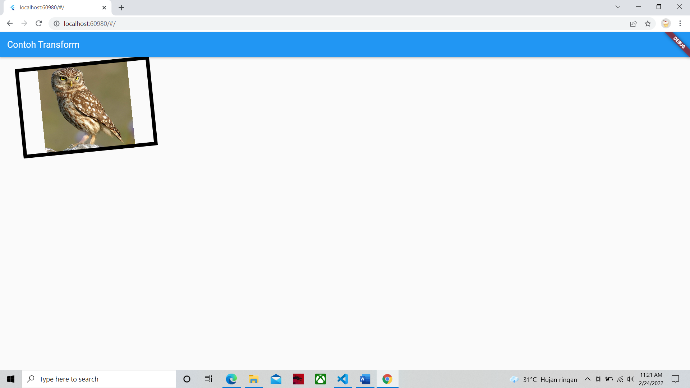
Nama = Bagas Prambudi Nim = 2031710108